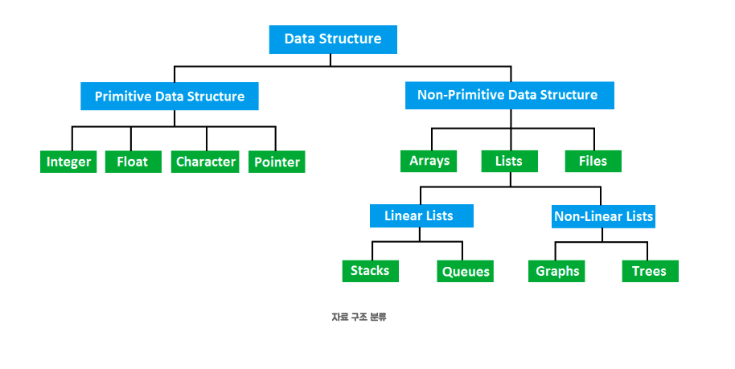

공식문서 참조해보기

# 자료구조에 대해서 설명해주세요

## 자료구조

각 원소(구조를 이루는 최소단위의 데이터)들이 논리적인 규칙에 의해 나열되며, 
데이터 값의 모임, 자료(데이터)에 대한 처리를 효율적으로 할 수 있도록 자료(데이터)를 구분한 것

### 예시
메모리: 책장
데이터: 책
자료구조: 책을 꽂는 방식(가나다순, 장르별 등)

공간효율 뿐만 아니라 시간효율도 고려

## 자료구조 + 알고리즘 = 프로그램
자료구조: 데이터를 조직화하고 저장하는 방식
알고리즘: 데이터를 처리하는 논리적 절차
프로그램: 자료구조 + 알고리즘

## 자료구조의 종류

1. 배열 (Array)
데이터를 **번호표(인덱스)**가 붙은 칸에 순서대로 빈틈없이 채워 넣은 구조입니다.
특징: 데이터가 메모리상에 나란히 붙어 있습니다.
장점: 인덱스(방 번호)만 알면 $O(1)$의 속도로 매우 빠르게 데이터를 찾을 수 있습니다.
단점: 중간에 데이터를 끼워넣거나 빼려면 뒤에 있는 데이터들을 다 밀거나 당겨야 해서 힘듭니다.

2. 연결 리스트 (Linked List)
데이터(노드)들이 다음 데이터가 어디 있는지 알려주는 **화살표(포인터)**로 이어져 있는 기차 같은 구조입니다.
특징: 데이터가 메모리 여기저기 흩어져 있어도 화살표만 따라가면 됩니다.
장점: 중간에 데이터를 넣거나 뺄 때 화살표 연결만 살짝 바꿔주면 되어 편리합니다.
단점: 특정 데이터를 찾으려면 맨 앞부터 화살표를 따라 하나씩 가봐야 해서 느립니다.

3. 스택 (Stack)
**'밑이 막힌 원통'**을 생각하세요. 먼저 들어간 게 가장 나중에 나옵니다 (LIFO, Last-In-First-Out).
특징: 뒤로 가기(Ctrl+Z)나 함수 호출 기록 관리 등에 쓰입니다.

4. 큐 (Queue)
'줄 서기' 또는 **'양쪽이 뚫린 터널'**입니다. 먼저 들어간 게 먼저 나옵니다 (FIFO, First-In-First-Out).
특징: 프린터 인쇄 대기열이나 맛집 줄 서기 시스템에 쓰입니다.

5. 해시 테이블 (Hash Table)
**'사물함 키(Key)'**를 넣으면 바로 **'내용물(Value)'**이 나오는 마법의 상자입니다.
특징: 해시 함수를 이용해 데이터를 저장할 위치를 즉시 계산합니다.
장점: 데이터의 양이 아무리 많아도 찾는 속도가 매우 빠릅니다.

6. 트리 (Tree)
뿌리에서 나뭇가지가 뻗어 나가듯 계층 구조를 가진 형태입니다.
특징: 컴퓨터의 폴더 구조(C 드라이브 > Program Files > ...)나 조직도에 사용됩니다.
이진 트리: 각 가지가 최대 2개씩만 뻗어 나가는 형태가 가장 흔합니다.

7. 힙 (Heap)
여러 값 중 최댓값이나 최솟값을 빠르게 찾아내기 위해 만든 특별한 트리입니다.
특징: 부모 노드가 자식 노드보다 항상 크거나(최대 힙), 항상 작게(최소 힙) 유지됩니다. 우선순위 큐를 구현할 때 주로 씁니다.

8. 그래프 (Graph)
데이터(정점)들이 그물망처럼 복잡하게 연결된 구조입니다.
특징: 지하철 노선도, SNS의 친구 관계, 내비게이션 경로 탐색 등에 사용됩니다. 방향이 있을 수도, 없을 수도 있습니다.

플러터에서는
위젯트리구조
트리탐색알고리즘

---

각각의 자료구조 종류를 그림으로
실제 적용할 때 어떻게 적용되는가
리두, 언두-> 스택