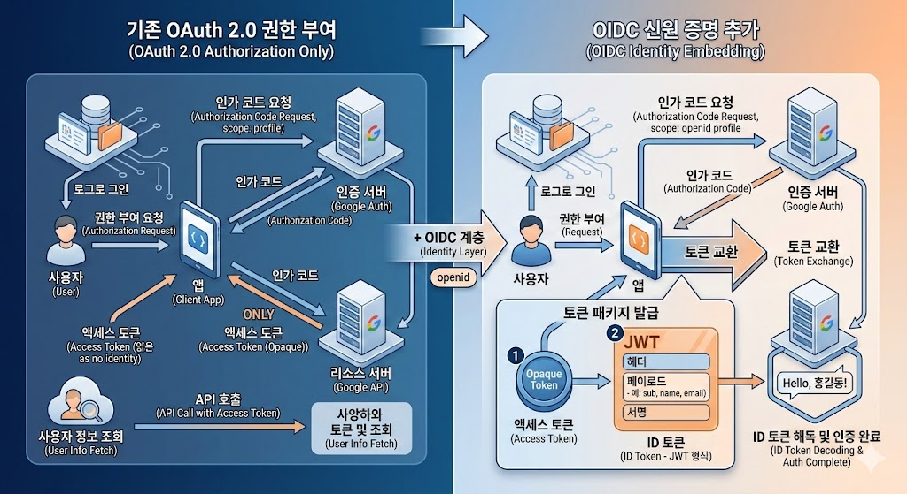
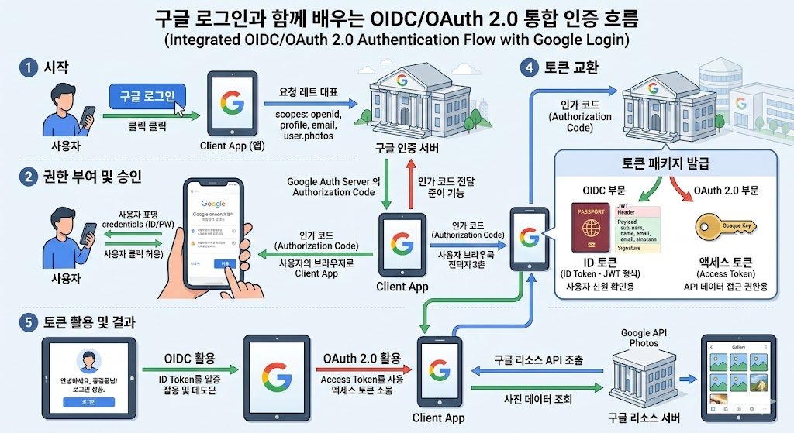

Oauth2.0과 OIDC 의 차이는 무엇인가요?

## Oauth2.0: 권한 부여 (Authorization)
(사용자의 비밀번호를 직접 공유하지 않고) 특정 서비스의 자원을 다른 서비스가 사용할 수 있도록 권한을 허가해주는 프레임워크
다른 서비스의 데이터 접근을 허용

목적: 권한 부여
발행물: 엑세스토큰 

## OIDC: 인증 (Authentication)
OIDC 은 Ouath2.0 프로토콜 위에서 돌아가는 신원확인 계층
Oauth2.0은 "당신은 이 방에 들어올 수 있다"를 결정한다면 ODIC은 "당신은 누구인가"를 결정

목적: 인증(누구인가?)
발행물: 아이디 토큰(사용자 정보가 담긴 JWT 형식의 데이터)

과거에는 Ouath2.0의 편법으로 '로그인' 기능을 구현, 하지만 엑세스토큰은 단순히 '문열기'용이라 사용자 정보를 가져오는 방식이 제각각
이를 표준화하기 위해 Ouath2.0의 토큰 발급절차는 그대로 사용하되, 그 안에 신원증명서(아이디토큰)을 끼워 넣기로 약속한 것이 OIDC

